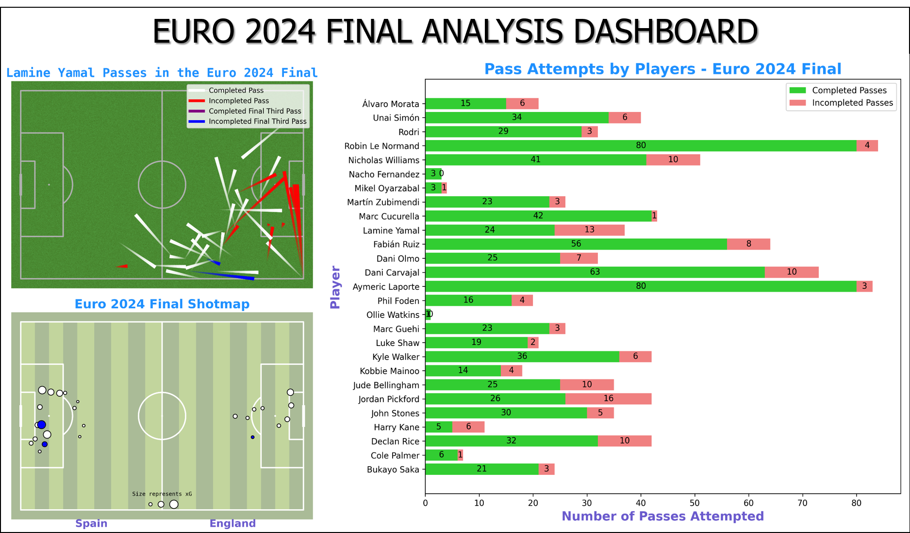

# euro-2024-final-analysis

## Source
*statsbomby package in python*
- sb.competitions()
- sb.matches(competition_id = 55, season_id = 282)
- sb.events(match_id = 3943043)

### libraries used:
- mplsoccer
- statsbomby
- pandas
- matplotlib

## Insights
### Passmap of Lamine Yamal
Lamine Yamal had a total of 37 passes attempts and had an accuracy of 64.% (24/37) passes completed. He tried to create 2 Final Third Passes but failed to convert them both as one was out of bounds and the other was intercepted.

### Bar Chart
- Both Le Normand	and Laporte Spain's Defenders had 80 completed passes while misplacing less than 5 passes and having a pass accuracy of 95% (80/84) and 96% (80/83) respectively.
- Ollie Watkins had only 1 pass attempted despite coming on in the 61st minute.
- Jordan Pickford had the worst passing accuracy which was 61.5% with 16 out 26 passes completed.

### Shotmap
- The 2nd white ball from the top in England's Shotmap represents the shot taken by Marc Guehi which was saved by Dani Olmo's ridiculous reaction speed where he headed the ball away by performing a goal line clearance. The Probability of the goal was 0.5Xg.

- 

### DASHBOARD

